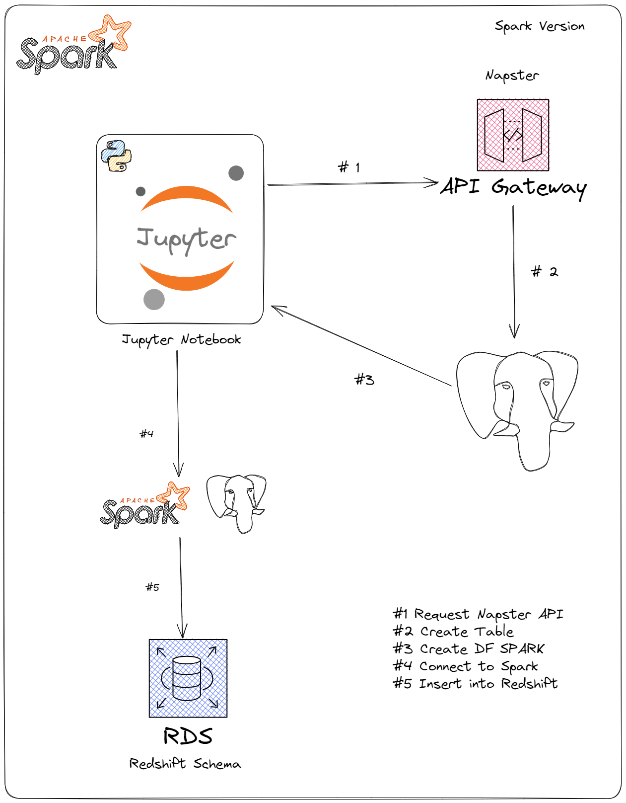

# Entregable Uno

You need to create a script that takes data from a public API and create a table that will be load in Redshift.

**The environment such that the Notebooks work has been instructed in the main README**

# API Napster KEY

To create a napster key just go https://developer.prod.napster.com/ and create a key that should be loaded in the .env

## Objectives

1. Script extracts json data that is loaded as a DICT.
2. It includes a table creation and its definition.
3. It should be written in python.

## Scripts

Two examples were created. The first example, uses just Pandas, while the second uses pyspark.
The design for the pandas one is the next:

The design for the pyspark one is:

